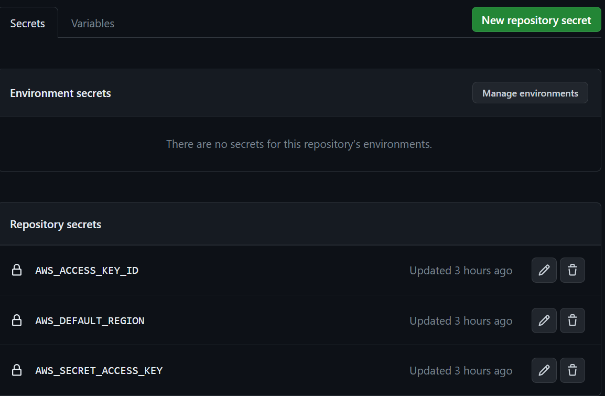

# Lambda Typescript Deployment

## How to deploy lambda easily?

### Requirements
- AWS Lambda
- Typescript Project


## Setup project
#### Project Structure
deploy-lambda.yaml is github action configuration file. \
which should be located in `.github/workflows/`

```text
└── .github
     ├── workflows
          ├── deploy-lambda.yaml
├── package.json
├── tsconfig.json
├── node_modules
│    ├── module_1
│    ├── module_2
│    └── etc..
└── src
     ├── index.ts
```
#### index.ts
```typescript
import { APIGatewayEvent, Context } from 'aws-lambda';
import {S3Client} from '@aws-sdk/client-s3'
import {GetObjectCommand} from "@aws-sdk/client-s3";

const s3Client = new S3Client({
    region: process.env.AWS_REGION
})
export async function handler (event: APIGatewayEvent, context: Context) {
    const res = await s3Client.send(new GetObjectCommand({
        Bucket: process.env.S3Bucket,
        Key: process.env.S3Key
    })).then(res=>res.Body as ReadableStream)
}

```

### Transpile to js
.ts should be .js for executing lambda

Deploy lambda with specific directory structure

### Project structure in lambda
directory is should be like

```text
/var/task
└── index.js # Lambda will start this as entrypoint!
├── node_modules
```

## Setup github action

Refer to [this](https://github.com/marketplace/actions/aws-lambda-deploy)


### Set Secrets key
github > settings > Secrets and variables > Actions > Secrets



### Set github action yaml

```yaml
name: AWS Lambda deploy

on:
  push:
    branches: [ main ]

jobs:
  deploy:
    runs-on: ubuntu-latest
    steps:
      - name: checkout source code
        uses: actions/checkout@v3

      - name: Install Dependencies
        run: yarn install

      - name: Build
        run: yarn build

      - name: Move node_modules to dist
        run: mv node_modules dist/node_modules

      - name: Zip
        run: (cd dist && zip -r ../function.zip .)

      - name: AWS Lambda Deploy
        uses: appleboy/lambda-action@v0.1.9
        with:
          function_name: Your-lambda-function-name
          runtime: nodejs16.x
          memory_size: 256
          timeout: 30
          aws_access_key_id: ${{ secrets.AWS_ACCESS_KEY_ID }}
          aws_secret_access_key: ${{ secrets.AWS_SECRET_ACCESS_KEY }}
          aws_region: ${{ secrets.AWS_DEFAULT_REGION }}
          zip_file: function.zip
          handler: index.handler
```

### Tips
`handler` should be `${fileName}.${functionName}` of lambda entrypoint.


### Reference
I made this repository and description from [Easily deploy TypeScript project to AWS Lambda using Github Actions - Nir Hadassi - medium](https://medium.com/aspecto/easily-deploy-typescript-project-to-aws-lambda-using-github-actions-5830c1cc3997)
